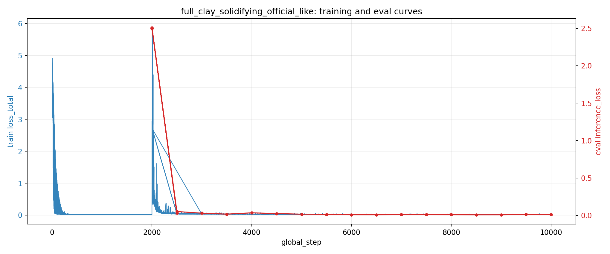

# NDAE

PyTorch implementation of the paper **Neural Differential Appearance Equations**.

This repository includes:

- YAML config loading and validation
- SVBRDF exemplar timeline sampling
- Differentiable renderer (Cook-Torrance variants)
- Perceptual/statistical losses
- Train / checkpoint / resume runtime
- Checkpoint-based sequence sampling and relighting workflows

## Documentation

GitHub Pages: https://ee5311-ca1-group25.github.io/ndae_doc/

## 1. Environment Setup

### 1.1 Install uv

macOS / Linux:

```bash
curl -LsSf https://astral.sh/uv/install.sh | sh
```

Windows (PowerShell):

```powershell
powershell -ExecutionPolicy ByPass -c "irm https://astral.sh/uv/install.ps1 | iex"
```

### 1.2 Install dependencies

From project root:

```bash
uv sync
```

This creates `.venv/` and installs dependencies from `pyproject.toml`.

### 1.3 Optional shell activation

```bash
source .venv/bin/activate
```

## 2. Quick Start Workflow

### 2.1 Dry-run (sanity check)

```bash
uv run python main.py --config configs/base.yaml --dry-run
```

Equivalent entrypoint:

```bash
uv run python scripts/train_svbrdf.py --config configs/base.yaml --dry-run
```

Dry-run behavior:

- loads config
- creates `outputs/<experiment.name>/`
- writes `config.resolved.yaml`
- prints run summary
- exits without optimization

### 2.2 Full-sequence training (`clay_solidifying`)

```bash
uv run python scripts/train_svbrdf.py --config configs/full_clay.yaml
```

### 2.3 Official-like training setup

```bash
uv run python scripts/train_svbrdf.py --config configs/full_clay_official_like.yaml
```

### 2.4 Resume from a checkpoint (example)

```bash
uv run python scripts/train_svbrdf.py --config configs/full_clay_official_like_resume.yaml
```

Important: resume requires a checkpoint marked `resume_ready=true` in `meta.json`.

## 3. Data Preparation Commands

### 3.1 Download a mini SVBRDF subset

```bash
uv run python scripts/download_svbrdf_mini.py --exemplar clay_solidifying --count 4
```

Manual-cookie fallback:

```bash
uv run python scripts/download_svbrdf_mini.py \
  --exemplar clay_solidifying \
  --count 4 \
  --cookie-header 'aws-waf-token=...; FIGINSTWEBIDCD=...'
```

Signed-URL fallback:

```bash
uv run python scripts/download_svbrdf_mini.py \
  --exemplar clay_solidifying \
  --count 4 \
  --signed-url 'https://s3-eu-west-1.amazonaws.com/...'
```

Semi-auto browser flow:

```bash
uv run python scripts/download_svbrdf_mini.py \
  --exemplar clay_solidifying \
  --count 8 \
  --semi-auto
```

### 3.2 Generate `_manifest.json` from a local exemplar directory

```bash
uv run python scripts/generate_svbrdf_manifest.py data_local/svbrdf_full/clay_solidifying
```

## 4. Monitoring and Evaluation

### 4.1 Live log tail

```bash
tail -f outputs/<experiment_name>/metrics.jsonl
```

### 4.2 Show latest eval entries

```bash
grep '"event": "eval"' outputs/<experiment_name>/metrics.jsonl | tail -n 10
```

### 4.3 Plot loss curves

```bash
uv run python scripts/plot_metrics.py \
  outputs/full_clay_solidifying_official_like/metrics.jsonl \
  --output outputs/full_clay_solidifying_official_like/loss_curve.png \
  --refresh-rate 6
```

## 5. Sampling and Rendering

### 5.1 Sample sequence from a concrete checkpoint

```bash
uv run python scripts/sample_svbrdf.py \
  --checkpoint outputs/full_clay_solidifying_official_like/checkpoints/step_010000 \
  --sample-size 256
```

Optional output override:

```bash
uv run python scripts/sample_svbrdf.py \
  --checkpoint outputs/full_clay_solidifying_official_like/checkpoints/step_010000 \
  --sample-size 256 \
  --output-dir outputs/full_clay_solidifying_official_like/samples/custom_step_010000
```

### 5.2 Render synthetic material examples

```bash
uv run python scripts/render_svbrdf_example.py \
  --preset plastic \
  --output outputs/render_example/plastic.png \
  --image-size 256
```

```bash
uv run python scripts/render_svbrdf_example.py \
  --preset coated_metal \
  --output outputs/render_example/coated_metal.png \
  --image-size 256 \
  --light-intensity 0.4 \
  --light-x 0.25 \
  --light-y -0.15
```

## 6. Relighting a Trained Checkpoint

The repository currently has no standalone relight CLI, but you can relight by
loading a checkpoint, overriding `flash_light` parameters, and re-rendering.

Example output used in this repo:

- `light_intensity = 0.6`
- `light_xy = (0.35, -0.35)`
- output: `outputs/full_clay_solidifying_official_like/samples/step_010000_relighted_i0p6_x0p35_y-0p35/`

## 7. CLI Parameter Reference

### 7.1 Train CLI (`main.py`, `scripts/train_svbrdf.py`)

| Argument | Type | Default | Description |
|---|---|---|---|
| `--config` | str | `configs/base.yaml` | YAML config path |
| `--output-root` | str | `None` | Override `experiment.output_root` |
| `--dry-run` | flag | `False` | Force dry-run regardless of config |

### 7.2 Sample CLI (`scripts/sample_svbrdf.py`)

| Argument | Type | Default | Required | Description |
|---|---|---|---|---|
| `--checkpoint` | str | - | Yes | Concrete checkpoint directory (`step_xxxxxx` or `latest`) |
| `--sample-size` | int | - | Yes | Sampling resolution |
| `--output-dir` | str | `None` | No | Override output directory |

### 7.3 Synthetic Render CLI (`scripts/render_svbrdf_example.py`)

| Argument | Type | Default | Description |
|---|---|---|---|
| `--output` | str | `outputs/render_example/<preset>.png` | Output image path |
| `--preset` | enum | `plastic` | `plastic` or `coated_metal` |
| `--image-size` | int | `256` | Render resolution |
| `--height-scale` | float | `5.0` | Height-to-normal scale |
| `--gamma` | float | `2.2` | Tonemap gamma |
| `--camera-fov` | float | `50.0` | Camera field of view |
| `--camera-distance` | float | `1.0` | Camera distance |
| `--light-intensity` | float | `0.0` | Log light intensity |
| `--light-x` | float | `0.2` | Light x-offset |
| `--light-y` | float | `-0.2` | Light y-offset |

### 7.4 Metrics Plot CLI (`scripts/plot_metrics.py`)

| Argument | Type | Default | Required | Description |
|---|---|---|---|---|
| `metrics` | Path | - | Yes | Path to `metrics.jsonl` |
| `--output` | Path | - | Yes | Output PNG path |
| `--refresh-rate` | int | `6` | No | Cycle length for grouped averages |

### 7.5 Mini Dataset Download CLI (`scripts/download_svbrdf_mini.py`)

| Argument | Type | Default | Description |
|---|---|---|---|
| `--exemplar` | str | `clay_solidifying` | Exemplar folder name in ZIP |
| `--count` | int | `4` | Uniform sample count when `--files` not set |
| `--files` | str[] | `None` | Explicit file basenames/paths |
| `--output-root` | str | `data_local/svbrdf_mini` | Output root directory |
| `--semi-auto` | flag | `False` | Open browser and prompt cookie/signed-url |
| `--cookie-header` | str | `None` | Manual cookie header |
| `--signed-url` | str | `None` | Pre-signed ZIP URL |
| `--session-name` | str | `svm-<timestamp>` | Playwright session name |
| `--list-exemplars` | flag | `False` | Print available exemplars and exit |
| `--overwrite` | flag | `False` | Overwrite existing local files |

### 7.6 Manifest Generator CLI (`scripts/generate_svbrdf_manifest.py`)

| Argument | Type | Default | Required | Description |
|---|---|---|---|---|
| `exemplar_dir` | str | - | Yes | Local exemplar image directory |
| `--exemplar` | str | directory name | No | Exemplar name override |
| `--page-url` | str | DOI URL | No | Source page URL written to manifest |
| `--download-url` | str | dataset URL | No | Source download URL written to manifest |

### 7.7 GIF Generator CLI (`scripts/generate_sample_gifs.py`)

| Argument | Type | Default | Description |
|---|---|---|---|
| `--samples-root` | Path | `outputs/full_clay_solidifying_official_like/samples` | Root directory containing sampled frame subfolders |
| `--subdir` | str (repeatable) | `step_010000`, `step_010000_relighted_i0p6_x0p35_y-0p35` | Subdirectory names to convert into GIFs |
| `--pattern` | str | `frames_*.png` | Frame filename glob pattern |
| `--duration-ms` | int | `70` | GIF frame duration in milliseconds |
| `--loop` | int | `0` | GIF loop count (`0` means infinite) |
| `--overwrite` | flag | `False` | Overwrite existing GIF files |

## 8. Tests

Run full test suite:

```bash
uv run pytest
```

Narrow regression slice:

```bash
uv run pytest tests/test_renderer.py tests/test_package_layout.py tests/test_config.py -q
```

## 9. Full-Run GIF Previews

This section summarizes qualitative and quantitative results from the full
official-like run on `clay_solidifying`.

### 9.1 Rendering Setup

- Checkpoint used for GIF rendering:
  `outputs/full_clay_solidifying_official_like/checkpoints/step_010000`
- Transition frames rendered: `100`
- Sample resolution: `256 x 256`
- Baseline GIF: default training-time lighting in resolved config
- Relighted GIF override:
  `light_intensity=0.6`, `light_xy=(0.35, -0.35)`

### 9.2 Quantitative Context (from `metrics.jsonl`)

- Final eval at step `10000`:
  `inference_loss = 0.008703134953975677`, `effective_lr = 0.0005`
- Best eval during this run:
  step `8500`, `inference_loss = 0.007525017485022545`

Interpretation:

- The final checkpoint is near the best region, with a small gap from the best
  eval point.
- This suggests training reached a stable plateau rather than diverging.

Training curve snapshot:



Curve analysis:

- `loss_total` decreases rapidly in early training and then enters a smoother
  low-variance regime.
- Eval `inference_loss` points track the same overall trend and remain in a
  narrow band near the end of training.
- The best eval appears before the final step, while the final checkpoint stays
  close to that optimum, indicating stable convergence.

### 9.3 Visual Comparison

Original lighting:


Relighted (`light_intensity=0.6`, `light_xy=(0.35, -0.35)`):


Observed behavior:

- Material detail remains coherent across time (no obvious frame-to-frame
  collapse).
- The relighted sequence shows expected highlight migration and contrast change
  under shifted light position.
- Fine-scale appearance varies smoothly, indicating the latent trajectory is
  temporally stable under re-rendering.

### 9.4 How to Reproduce

Render baseline sample frames:

```bash
uv run python scripts/sample_svbrdf.py \
  --checkpoint outputs/full_clay_solidifying_official_like/checkpoints/step_010000 \
  --sample-size 256
```

Render relighted frames (project-specific script/snippet workflow):

- load `step_010000`
- set `flash_light.intensity = 0.6`
- set `flash_light.xy_position = (0.35, -0.35)`
- render and save `frames_0000.png` ... `frames_0099.png`

Convert frame folders to GIF (scripted):

```bash
uv run python scripts/generate_sample_gifs.py
```

Useful options:

```bash
uv run python scripts/generate_sample_gifs.py \
  --samples-root outputs/full_clay_solidifying_official_like/samples \
  --subdir step_010000 \
  --subdir step_010000_relighted_i0p6_x0p35_y-0p35 \
  --duration-ms 70 \
  --loop 0 \
  --overwrite
```
